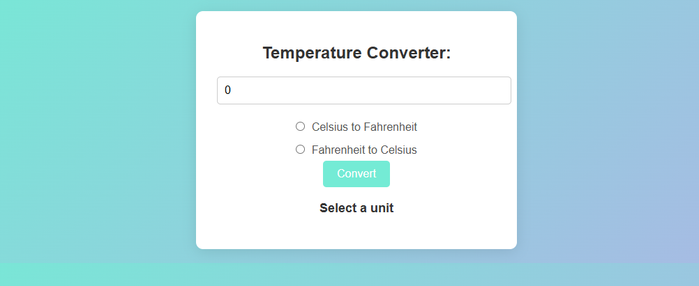

# 🌡️ Temperature Converter

A simple and responsive **Temperature Converter** built with **HTML, CSS, and JavaScript**.  
You can easily convert between **Celsius and Fahrenheit** with a clean and modern UI.  

---

## 🚀 Live Demo
🔗 [View Project on Netlify](https://your-netlify-link.netlify.app)

---

## 📸 Screenshot

---

## ✨ Features
- Convert Celsius ↔ Fahrenheit
- Responsive design for all devices
- User-friendly interface
- Input validation for better usability

---

## 🛠️ Built With
- **HTML5**  
- **CSS3** (Flexbox + Responsive design)  
- **JavaScript (ES6)**  

---

## 📚 Learning Goals
This project helped me practice:
- DOM manipulation with JavaScript
- Handling user input
- Implementing conditionals and functions
- Responsive design with CSS

---

## 👨‍💻 Author Kalkidan Asdesach
Made with ❤️ as part of my **#100DaysOfCode challenge**.
